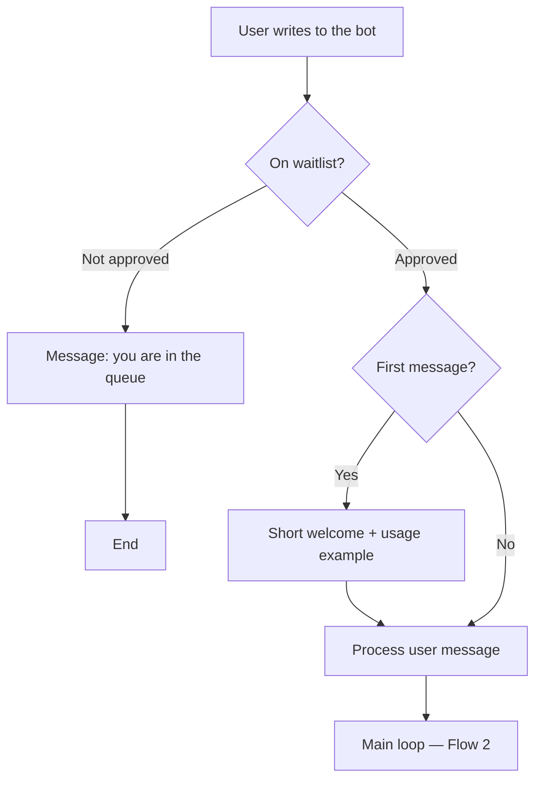
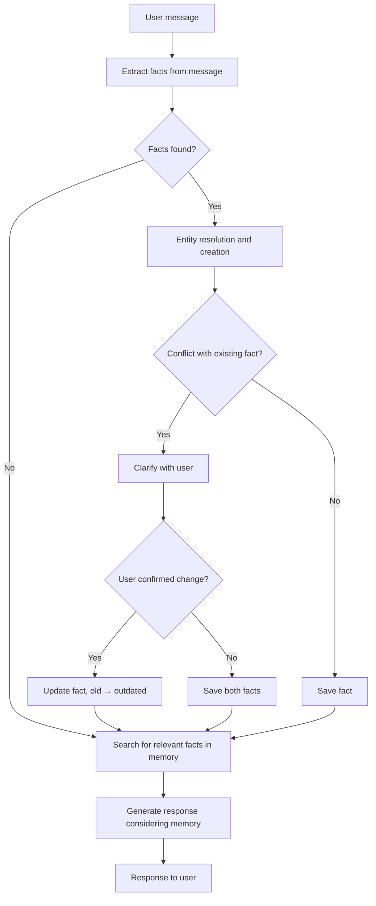
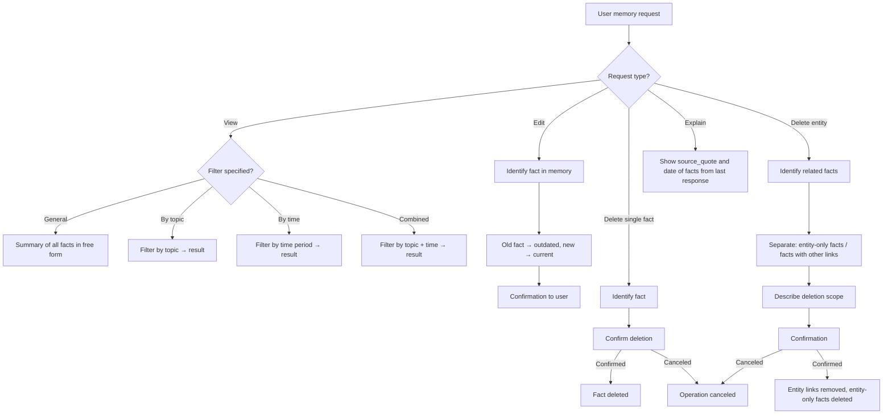
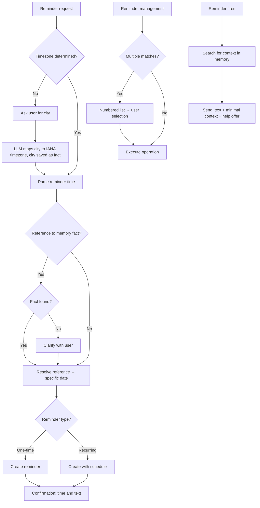
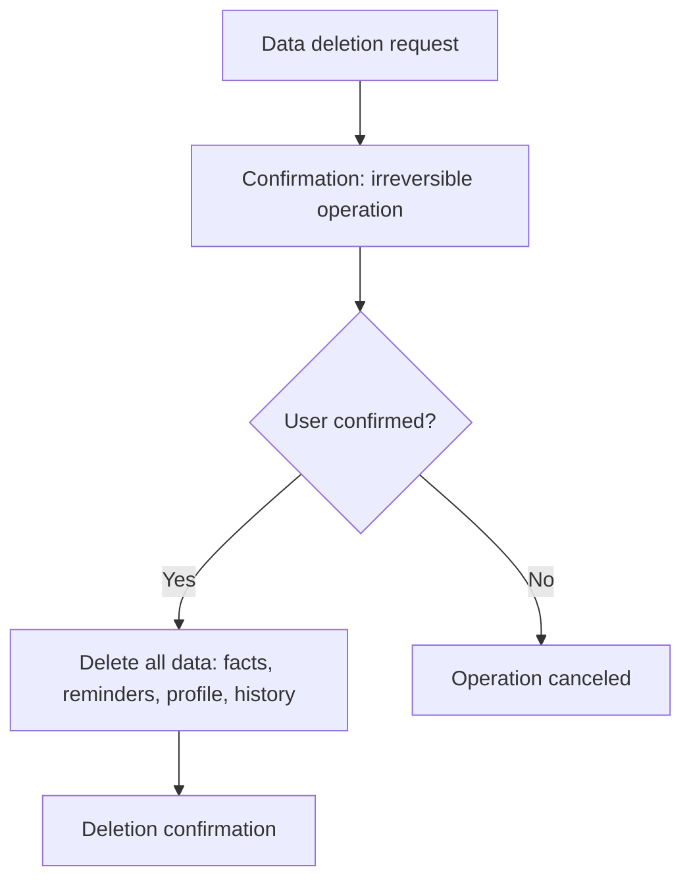
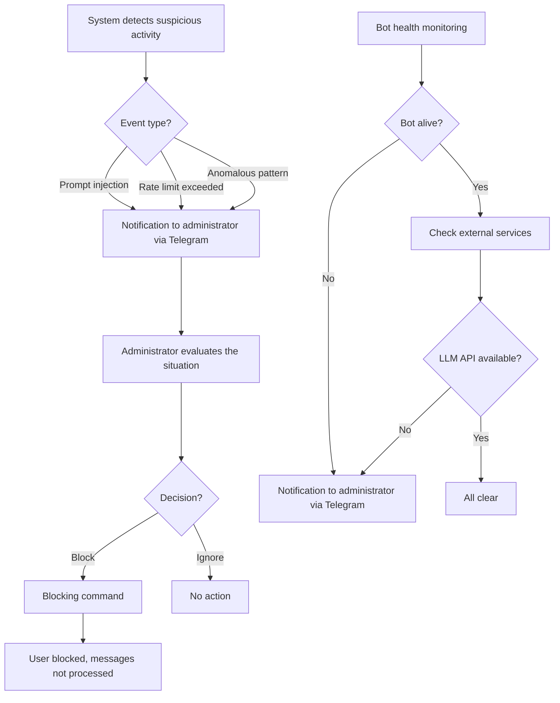

# 3.4 User Flow

## Conventions

- Diagrams describe the main flows (happy path) and key branching points.
- Negative and edge-case scenarios are covered in test cases (phase 6).
- Traceability to US and FR is indicated for each flow.

---

## Flow 1 · Onboarding

**Traceability:** US-ONB.1, US-ONB.2, US-REM.6

**Notes:**

- Waitlist is the first barrier. An unapproved user receives a single message and cannot use the bot. The administrator approves manually.
- The welcome is sent once on the first message from an approved user. It contains one usage example, without instructions or tutorials.
- Timezone is not determined during onboarding — it is requested upon the first reminder creation (Flow 4).

---

## Flow 2 · Main Memory Loop

**Traceability:** US-MEM.1, US-MEM.2, US-MEM.3, US-MEM.5

**Notes:**

- Every message goes through a fact extraction attempt. The LLM determines whether the message contains significant information.
- Entity resolution and creation (FR-MEM.3) happens before saving: the bot determines whether the fact relates to an existing entity or creates a new one.
- Conflict detection (FR-MEM.4) uses fact typing: "I work at Google" conflicts with "I work at Yandex" (type: workplace), but not with "I live in Berlin."
- Extraction and saving happen silently — the user only sees the final response enriched with memory context.

---

## Flow 3 · Memory Management

**Traceability:** US-MEM.6, US-MEM.7, US-MEM.8, US-MEM.9, US-MEM.10, US-MEM.13

**Notes:**

- Viewing adapts to volume: with a large number of facts (30+), the bot groups and summarizes instead of providing a full list.
- Editing always preserves history — the previous version is not lost but receives "outdated" status.
- Cascading deletion (FR-MEM.11) works through the FactEntity junction table. The bot must separate: (1) facts linked only to the entity being deleted → delete, (2) facts linked to other entities as well → remove only the link, (3) unrelated → leave untouched.
- Explanation (FR-MEM.13): the bot shows source_quote and date for facts used in the last response.

---

## Flow 4 · Reminders

**Traceability:** US-REM.1 – US-REM.6

**Notes:**

- Timezone detection is lazy: requested only upon the first reminder, not during onboarding. Fallback — ask for the city, LLM maps city → IANA timezone, city saved as fact. Updated if the bot discovers a timezone change fact in memory (relocation, travel).
- Memory-based reminders (FR-REM.7): "Remind me 3 days before Dima's birthday" → the bot searches for the date in memory. If not found — asks the user, does not create the reminder "blindly."
- During reminder management: if the user's request (cancel, modify) matches multiple reminders — the bot shows a numbered list and asks to choose (AWAIT, type: missing_data).
- When a reminder fires, the bot enriches it with minimal context from memory and offers help (e.g., "Want me to draft a greeting?").

---

## Flow 5 · Account Deletion

**Traceability:** US-PLT.1

**Notes:**

- Immediate deletion without grace period. All data is deleted: facts, change history, reminders, profile, timezone.
- After deletion, the user can write to the bot again — they will enter the waitlist as a new user.

---

## Flow 6 · Administration

**Traceability:** US-ADM.1, US-ADM.2

**Notes:**

- All administrator notifications are sent via Telegram — a single channel for monitoring.
- Blocking is a manual administrator decision. There is no automatic blocking, only alerts.
- Health monitoring includes the bot's own availability and external dependencies (LLM API).
