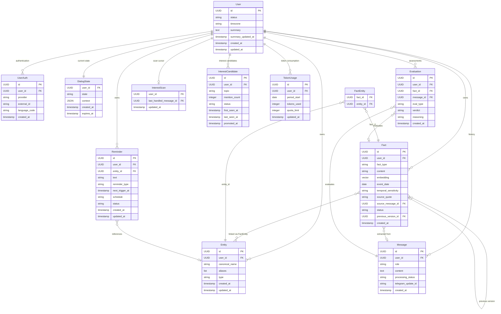

# 4.3 Data Model

## Conventions

- Description is at the logical level: entities, relationships, field purposes.
- Data types are generalized (string, number, date, reference, JSON). Specific types are determined after selecting the DBMS in System Architecture (4.4).
- The fact search method (vector, full-text, LLM context window) is determined in 4.4.
- Traceability to FR is provided for each entity.

---

## ER Diagram

---

## Entity Descriptions

### User — User Profile

**Traceability:** FR-PLT.2 (data isolation), FR-PLT.3 (account deletion), FR-REM.6 (timezone), FR-MEM.14 (context summary)

| Field | Description |
|-------|-------------|
| id | Internal identifier. The entire system references this, not the Telegram ID |
| status | Current status: `waitlist`, `active`, `paused`, `blocked` |
| timezone | Timezone in IANA format (e.g., `Europe/Berlin`). Source of truth. Null — not yet determined. Determined from the city in memory (LLM maps city → IANA) or via fallback: ask for city → LLM maps to IANA timezone, city is saved as a fact |
| summary | Text summary about the user (up to 2000 tokens). Contains two layers: (1) key facts — name, city, job, key people, preferences, current situation, current plans (short_term facts), (2) pattern-derived insights — price priorities, decision-making style, communication preferences, behavioral patterns. Automatically generated from active facts. Insights are included only when ≥3 supporting facts exist. Always included in the system prompt (Tier 1). Null — summary not yet generated |
| summary_updated_at | Timestamp of the last summary rebuild. Used to determine if an update is needed |
| created_at | Registration date |
| updated_at | Last update date |

**User statuses:**
- `waitlist` — awaiting approval (FR-ONB.2)
- `active` — full access
- `paused` — paused via `/stop`, data preserved, messages not processed
- `blocked` — blocked by administrator (NFR-SEC.4)

**Context summary (FR-MEM.14):** the `summary` field contains a text summary about the user with two layers: key facts and pattern-derived insights. Generated by a compact LLM model from active facts (`Fact.status = 'active'`). During rebuild, the LLM receives `temporal_sensitivity` of facts and accounts for it in phrasing. During rebuild, the LLM also assesses fact relevance — resolved/completed facts are marked as `outdated` via structured output. Rebuilt asynchronously (pg-boss job) when any of these conditions are met: (1) ≥ 5 new facts have accumulated since the last rebuild, (2) a key fact was changed (types `location`, `workplace`, `relationship`). During response generation, `summary` is always included in the system prompt as the first context tier (Tier 1) — before semantic search results.

---

### UserAuth — Authentication

**Traceability:** NFR-PORT.2 (delivery platform abstraction)

| Field | Description |
|-------|-------------|
| id | Record identifier |
| user_id | Reference to user |
| provider | Authentication platform: `telegram`. Post-MVP: `mobile_app` and others |
| external_id | Identifier on the external platform (Telegram user ID) |
| language_code | IETF language tag from Telegram API. Used for system templates |
| created_at | Record creation date |

**Why a separate table:** when adding a mobile app (post-MVP), the user will receive a second record with `provider: "mobile_app"`, without changing the rest of the structure.

---

### Entity — Entities from Memory

**Traceability:** FR-MEM.3 (entity resolution), FR-MEM.11 (cascade deletion)

| Field | Description |
|-------|-------------|
| id | Entity identifier |
| user_id | Owner |
| canonical_name | Primary name: "Dima," "Google," "son" |
| aliases | Alternative forms: "Misha," "my friend," "Dimon" |
| type | Entity type: `person`, `place`, `organization`, `other` |
| created_at | Creation date |
| updated_at | Update date |

**Entity resolution and creation (FR-MEM.3):** LLM determines which entity a mention refers to, using `canonical_name`, `aliases`, and conversation context. Exact string matching is not required — LLM works semantically. If no existing Entity matches the mention, a new Entity is created with a type determined by the LLM from the message context. `canonical_name` is set from the most complete form of the mention. Example: "went to the indoor Bella" → Entity: `{ canonical_name: "Bella", type: "place", aliases: ["indoor playground Bella"] }`.

**Cascade deletion (FR-MEM.11):** on "forget everything about Dima," the Entity and all FactEntity records with that `entity_id` are deleted. Facts that have links to other entities or the user (e.g., "went skiing") are preserved — only the link is removed.

---

### FactEntity — Fact-Entity Link

**Traceability:** FR-MEM.3 (entity resolution), FR-MEM.11 (cascade deletion)

| Field | Description |
|-------|-------------|
| fact_id | Reference to fact |
| entity_id | Reference to entity |

**Why a separate table:** a fact can be linked to multiple entities (many-to-many). Example: "Went skiing with Dima and Misha" — one fact, two links. This affects cascade deletion: when deleting the entity "Dima," only the FactEntity link is removed; the fact is preserved with its link to "Misha."

---

### Fact — Memory Fact

**Traceability:** FR-MEM.1 (extraction), FR-MEM.2 (storage with history), FR-MEM.4 (conflicts), FR-MEM.9 (editing), FR-MEM.10 (deletion)

| Field | Description |
|-------|-------------|
| id | Fact identifier |
| user_id | Owner |
| fact_type | Fact type. Fixed set of values (enum), determined via structured output from a compact model: `location`, `workplace`, `relationship`, `event`, `preference`, `health`, `date`, `financial`, `other`. LLM selects from the list; if none fits — `other` |
| content | Fact text: "Lives in Munich," "Peanut allergy" |
| embedding | Vector representation of `content` (1536 dimensions, OpenAI text-embedding-3-small). Used for semantic search of relevant facts via pgvector (4.4) |
| event_date | Event date. LLM determines the date from the message context (e.g., "went to the doctor yesterday" → yesterday's date). If LLM cannot determine — copies `created_at`. Always populated. Used for time-based search (FR-MEM.8) |
| temporal_sensitivity | Time sensitivity: `permanent` (stable fact, updated only explicitly), `long_term` (relevant for months–years), `short_term` (relevant for days–weeks, intention/plan/process). Determined by LLM during extraction via structured output. Used for relevance checks (FR-MEM.6) and phrasing in User Summary (FR-MEM.14) |
| source_quote | Verbatim quote from the user's message |
| source_message_id | Reference to the message from which the fact was extracted. For evaluation and audit |
| status | Relevance: `active`, `outdated` |
| previous_version_id | Reference to the previous version of the fact. Null — first version |
| created_at | Creation date |

**Link to entities:** established through the FactEntity junction table (many-to-many). A fact without links is a fact about the user.

**Versioning:** when updating a fact, a new record is created with status `active`, and the old one is marked as `outdated`. The chain is recovered via `previous_version_id`.

**Conflict detection (FR-MEM.4):** LLM compares the new fact with the user's existing facts. `fact_type` is used as a hint for the LLM, not as a condition in code — no code branches on this field's value.

**`fact_type` taxonomy (fixed enum):**

| Type | Description | Example |
|------|-------------|---------|
| `location` | Place of residence, city | "Lives in Munich" |
| `workplace` | Workplace, position | "Works at Yandex" |
| `relationship` | Relationships with people | "Dima — friend" |
| `event` | Event, occurrence | "Son started kindergarten" |
| `preference` | Preference, taste, evaluative judgment | "Vegetarian," "Bella playground — expensive," "Doesn't like spicy food" |
| `health` | Health, medical | "Peanut allergy" |
| `date` | Significant date | "Birthday March 15" |
| `financial` | Financial information | "Owes Misha 5000" |
| `other` | Everything that doesn't fit other categories | "Learning Spanish" |

`fact_type` normalization occurs during extraction (structured output), before writing to the DB.

---

### Reminder — Reminder

**Traceability:** FR-REM.1 (one-time), FR-REM.2 (recurring), FR-REM.3 (context), FR-REM.4 (management), FR-REM.7 (memory-based)

| Field | Description |
|-------|-------------|
| id | Reminder identifier |
| user_id | Owner |
| entity_id | Linked entity. Used for context enrichment on trigger |
| text | Reminder text: "Wish Dima happy birthday," "Report" |
| reminder_type | Type: `one_time`, `recurring` |
| next_trigger_at | Next trigger time (UTC) |
| schedule | Recurrence pattern for recurring in iCalendar RRULE format (RFC 5545). LLM converts the user's request to RRULE on creation, a library computes `next_trigger_at`. Null for one-time |
| status | Current status: `active`, `delivered`, `cancelled` |
| created_at | Creation date |
| updated_at | Update date |

**Context on trigger (FR-REM.3):** when `entity_id` is present, the bot pulls current facts about the entity and enriches the reminder. "Wish Dima happy birthday 🎂 He's turning 35, lives in Berlin."

**Recurring reminders:** after triggering, `next_trigger_at` is recalculated from `schedule` via an RRULE library. Status remains `active`.

---

### Message — Message

**Traceability:** FR-MEM.2 (source_quote), NFR-OBS.1 (logging), NFR-REL.3 (retry after failure)

| Field | Description |
|-------|-------------|
| id | Message identifier |
| user_id | Owner |
| role | Author: `user`, `bot` |
| content | Full message text |
| processing_status | Processing status: `received` (received), `processed` (processed), `failed` (failure). On LLM failure, the message is saved with `failed` status for retry |
| telegram_update_id | Telegram update identifier. Used for idempotent processing — prevents duplication on retry |
| created_at | Send time |

**Retry after failure (NFR-REL.3):** messages with `failed` status are reprocessed via a pg-boss job on recovery. Idempotency via `telegram_update_id`.

**Why store history:** short-term context is needed for pronoun resolution ("he," "that friend"), understanding the conversation topic, and verifying source_quote in facts.

**Short-term context (short-term memory):** formed from two sources:
1. Last 5 message pairs (user + bot) — always, for immediate conversational coherence.
2. Semantically relevant message pairs via embedding search on Message (top 5–10). Embeddings are stored for message pairs (user + bot as one chunk) — more cost-effective than feeding all messages into context.

**Session determination:** sessions are computed from `Message.created_at` — a gap > 30 minutes between messages indicates a new session. A separate table is not required.

**Retention:** indefinite. Memory is the core product; messages are the foundation. A rotation policy is determined after MVP.

---

### DialogState — Dialog State

**Traceability:** 4.1 Information Architecture (state diagram)

| Field | Description |
|-------|-------------|
| user_id | One state per user (1:1) |
| state | Current state: `idle`, `confirm`, `await`. Specific behavior is determined by the `context.type` field |
| context | Data for continuing the scenario. Includes `type` (discriminator) and type-specific data |
| created_at | Time of entering the state |
| expires_at | Time of automatic reset to `idle` |

**`context` field — content by type:**

`confirm` state:
- `{ "type": "conflict", ... }`: new fact and existing conflicting fact
- `{ "type": "delete", ... }`: identifiers of facts and/or entity for deletion
- `{ "type": "account_delete" }`: confirmation requires no data
- `{ "type": "interest", ... }`: candidate_id and topic for interest confirmation

`await` state:
- `{ "type": "missing_data", ... }`: original intent and missing field. Includes timezone determination fallback: if city is unknown during first reminder creation — bot asks for city

**Reset:** when `expires_at` < now or when a message with a different intent is received → state = `idle`, context = null.

---

### Evaluation — Automatic Quality Assessment

**Traceability:** Goals 2.2 (extraction accuracy ≥ 85%, application relevance ≥ 80%)

| Field | Description |
|-------|-------------|
| id | Record identifier |
| user_id | Owner |
| fact_id | Evaluated fact. Null — if evaluating memory application (not extraction) |
| message_id | Contextual message. For `extraction_accuracy` — the user's message from which the fact was extracted. For `application_relevance` — the bot's message in which memory was applied |
| eval_type | Evaluation type: `extraction_accuracy`, `application_relevance` |
| verdict | Result: `correct`, `incorrect`, `partial` |
| reasoning | Justification from the judge model |
| created_at | Evaluation time |

**Logic:** every 5th message is sent for asynchronous evaluation by an LLM judge (compact model). Two evaluation types:
- `extraction_accuracy` — judge receives the user's original message and the extracted fact, evaluates extraction correctness.
- `application_relevance` — judge receives the user's request, applied facts, and the bot's response, evaluates the appropriateness of memory application.

Results are aggregated via Drizzle Studio for metric tracking.

**Request complexity classification** (`trivial` / `standard` from FR-COM.5) is not persisted in the Data Model — it's a runtime pipeline decision. Logged in structured logs (NFR-OBS.1) for distribution analysis.

---

### InterestScan — Interest Scan Cursor

**Traceability:** FR-MEM.15 (interest detection)

| Field | Description |
|-------|-------------|
| user_id | One record per user (1:1) |
| last_handled_message_id | Reference to the last processed message. The job analyzes only messages after this cursor |
| updated_at | Last scan time |

**Logic:** pg-boss job `detect_interests` checks the count of new chat-intent messages after the cursor. If ≥ 20 — runs LLM analysis. After processing, updates the cursor.

---

### InterestCandidate — Interest Candidate

**Traceability:** FR-MEM.15 (interest detection)

| Field | Description |
|-------|-------------|
| id | Record identifier |
| user_id | Owner |
| topic | Normalized topic, determined by LLM during analysis. LLM groups "dinosaurs" + "Jurassic period" + "tyrannosaurus" into one topic |
| mention_count | Number of detected mentions. Cumulative — each job increments |
| status | Status: `tracking` (being tracked), `promoted` (reached threshold, awaiting confirmation), `confirmed` (user confirmed), `dismissed` (user declined) |
| first_seen_at | Time of first topic detection |
| last_seen_at | Time of last detection |
| promoted_at | Time of promotion to inline question. Null before promotion |

**Lifecycle:**
1. Job detects a recurring topic → `tracking`, `mention_count` incremented
2. `mention_count` ≥ 3 → `promoted`, `promoted_at` populated
3. On the next chat request on this topic → bot asks an inline question → CONFIRM (type: interest)
4. Confirmation → `confirmed`, Fact created with `fact_type: preference`. Rejection → `dismissed`

**Topic normalization:** on each job run, the LLM receives the list of existing InterestCandidates (status = `tracking` or `promoted`) to match new findings to existing topics.

---

### TokenUsage — Token Consumption

**Traceability:** FR-PLT.4 (token quota), NFR-SEC.2 (token quota), NFR-COST.2 (hard cap per user)

| Field | Description |
|-------|-------------|
| id | Record identifier |
| user_id | Owner |
| period_start | Start date of the current monthly period |
| tokens_used | Cumulative token counter for the period. Incremented after each LLM call |
| quota_limit | Monthly token limit for the user. Specific value determined after launch |
| updated_at | Last counter update date |

One record per user per month. New records are created monthly via a pg-boss job. When `tokens_used` >= `quota_limit` — full processing block, notification to the user and administrator.

---

## Account Deletion (FR-PLT.3)

Upon deletion confirmation, all user data is cascade deleted:

1. Evaluation (WHERE user_id)
2. InterestCandidate (WHERE user_id)
3. InterestScan (WHERE user_id)
4. TokenUsage (WHERE user_id)
5. DialogState (WHERE user_id)
6. Message (WHERE user_id)
7. Reminder (WHERE user_id)
8. FactEntity (WHERE fact_id IN (SELECT id FROM Fact WHERE user_id))
9. Fact (WHERE user_id)
10. Entity (WHERE user_id)
11. UserAuth (WHERE user_id)
12. User

Order is determined by dependencies. Deletion from the DB is immediate, with no grace period. Caveat: data may persist in backups for up to 7 days (backup retention).

---

## Data Isolation (FR-PLT.2)

Every table (except User) contains `user_id`. All data queries are filtered by `user_id` at the application level. This ensures strict data separation between users (NFR-SEC.1).

---

## Traceability to FR

| Entity | FR |
|---|---|
| User | FR-PLT.2, FR-PLT.3, FR-REM.6, FR-ONB.2, NFR-SEC.4, FR-MEM.14 |
| UserAuth | NFR-PORT.2 |
| Entity | FR-MEM.3, FR-MEM.11 |
| FactEntity | FR-MEM.3, FR-MEM.11 |
| Fact | FR-MEM.1, FR-MEM.2, FR-MEM.4, FR-MEM.6, FR-MEM.6a, FR-MEM.7, FR-MEM.8, FR-MEM.9, FR-MEM.10, FR-MEM.13 |
| Reminder | FR-REM.1, FR-REM.2, FR-REM.3, FR-REM.4, FR-REM.7 |
| Message | FR-MEM.2, NFR-OBS.1, NFR-REL.3 |
| DialogState | 4.1 IA, FR-MEM.13 |
| Evaluation | Goals 2.2 |
| InterestScan | FR-MEM.15 |
| InterestCandidate | FR-MEM.15 |
| TokenUsage | FR-PLT.4, NFR-SEC.2, NFR-COST.2 |
